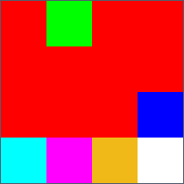
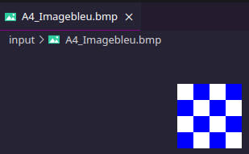
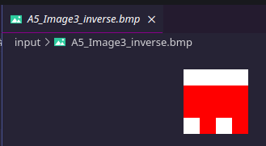
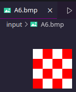
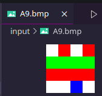
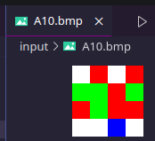
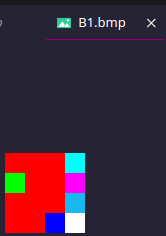
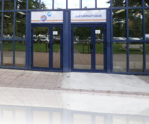

# rapport sae image bmp

# PAVARD Arthur 1A4A

# A0 Prise de contact

nous traitons cette image


et comme dit dans l'énoncer il y a cette erreur


qui est par ce que la taille de l'image (dans le header) et la taille du fichier ne sont pas les mêmes
, nous pouvons reparer le header et manuellement changer cette valeur de `99` a `9A`
le projet nous donne aussi un warning si cette meme erreur se produit


# A1
faire l'image
avec le projet il est simple de crée une image pixel par pixel
```plaintext
424d4a000000000000001a0000000c00000004000400010018000000ffffffff0000ffffffffffffff0000ffffffff0000ff0000ffffffff0000ffffffffffffff0000ffffffff0000ff
```


# A2
image crée
```plaintext
424d4a000000000000001a0000000c0000000400040001001800ffff00ff00ff17b9f0ffffff0000ff0000ff0000ffff00000000ff0000ff0000ff0000ff0000ff00ff000000ff0000ff
```

# A3
la class BMPFile a en information TOUT les format de header et fait facilement des changement a ces formats
donc juste selectionner le format de header que vous voulez et sauvegarder
car `convert` ne respecte pas le setting de DPI


1.Combien y-a-t-il de bits par pixel ?
et bien il y a plusieur facons de répondre a cette question , on peut voire dans l'en-tête de votre image (BITMAPINFOHEADER) que le décalage pixels est 36h (54) et on vois que le pixel est rouge ; et dans le fichier le code est `00 00 FF` ce qui encode le pixel en GBR (RGB inverser) avec 24 bits (8bits par chanels) ou l'on peut regarder décalage 1Ch (offset pour le nombre de bits par pixel `bits_per_pixel`) ce qui nous donne `18 00` qui correspond a 24 bits

2.Quelle est la taille des données pixels ?
L'en-tête indique `66 00 00 00` , ce qui nous donne une taille de fichier de 102 bytes.
si on calcule toute les parties du fichier (file size=102, file header=14, infoheader=40, palette 0)=> 102 - 54 = pixels 48
ou l'on peut faire que il y a 24 bits 3 bytes * (4*4) = 48.

3.Y a-t-il une compression utilisée ?
L'en-tête est capable de choisir une méthode de compression mais la valeur `00 00 00 00` est aucune compression.
donc non le fichier n'est pas compresser.

4.Le codage des pixels a-t-il changé ?
Les valeurs `FF FF FF` représentent des pixels blancs dans votre image, et `00 00 FF` représentent les pixels rouge exactement comme avant.

# A4
j'aurai bien voulue dire que mon outils fonctionne aussi bien avec des palettes de couleurs mais il est buggé.

1. Combien y-a-t-il de bits par pixel? 
Dans l'en-tête de l'image `01 00` donc 1 bit par pixel ;
et si l'on regarde la palette `00 00 FF 00` ; `FF FF FF FF 00` 32 bits GBRA 8.8.8.8 par couleur.

2. Quelle est la taille des données pixels? 
L'en-tête indique `3E 00 00 00` en offset pour la table des pixels et une taille de fichier de 78 , 78 - 62 = 16;
avec la palette , l'image ne prend plus que 16 bytes pour stocker 32 bits depth color 4*4 pixels.

3. Y a-t-il une compression utilisée? 
L'en-tête indique `00 00 00 00`, donc aucune compression.

4. Comment sont codées les couleurs de la palette? La palette de couleurs est donnée par les valeurs hexadécimales `00 00 FF 00` ; `FF FF FF 00`. Chaque couleur est codée sur 4 octets, 32 bits GBRA 8.8.8.8 par couleur.

5. Quel est le nombre de couleurs dans la palette? La palette contient deux couleurs distinctes, car il y a deux valeurs distinctes (rouge et blanc).

6. Le codage des pixels a-t-il changé? Oui, les pixels sont maintenant codés sur 32 bits (au lieu de 24 bits précédemment). Cela est dû à l'utilisation d'une palette de couleurs, où chaque pixel est représenté par un index d'un seul bit faisant référence à une couleur dans la palette.


7.


8.


9.


10.


11. A quelle adresse peut-on trouver le nombre de couleurs qu'il y a dans la palette?
on retrouve le nombre de couleur a l’adresse (palette_colors) 0x000E (32d) ou il y a noté `10 00 00 00` = 16

12.A quelle adresse dans la palette peut-on trouver la couleur à dominante "Blanc" utilisée par cette image?
[[116, 43, 6, 0], [92, 35, 10, 0], [112, 80, 56, 0], [12, 102, 250, 0], [32, 103, 232, 0], [81, 111, 171, 0], [134, 53, 12, 0], [161, 91, 21, 0], [205, 121, 15, 0], [156, 111, 82, 0], [205, 146, 61, 0], [244, 232, 216, 0], [254, 254, 253, 0], [229, 223, 220, 0], [221, 193, 162, 0], [92, 145, 221, 0]]
la palette en RGBA
l'index est 12 pour le plus proche du blanc

13.Où commence le tableau de pixel?
la palette commence après le header de 36h a 54h
vu que l'offset du début du tableau de pixel est dans le header alors il peut y avoir un trou entre la palette et le tableau de pixel.
donc apres le 00 est le tableau de pixels de 56h jusqu'a la fin

14.placez quelques pixels bleus tout en bas de l'image. Pour obtenir en bas à gauche de l'image ceci (visualisez en utilisant Gimp par exemple ; oui avec gimp)


15.Que se passe-t-il si l'on diminue le nombre de couleurs dans la palette? Que se passe t-il d'un point de vue visuel? Et dans l'hexa?

le programme est obliger de plus en plus faire des compromis jpg pour compresser l'espace de couleur dans la palette disponible donc il y a moins de contraste

# A5
1. ok

2. Changez dans l'entête du fichier la valeur de la hauteur de l'image. Elle est à l'origine de valeur 4 pixels, changez pour la valeur négative de  -4 pixels. Que ce passe-t-il?

les valeurs négatives sont coder en C2 ,
nous devont changer la hauteur a l’adresse 16 `04 00 00 00` en negatif donc ca donne `FC FF FF FF` (2**32-4) et l’image s’inverse



3.Profitez de cette information pour obtenir facilement à partir de ImageExempleIndexBMP3_16.bmp.

a l’adresse 16 il y a `A9 01 00 00` => 2**16-425 = FE57  `57 FE FF FF`


# A6
### Un fichier BMP avec compression
Il existe un mode de compression facultatif dans les fichiers BMP. Le type de compression est RLE. Vous trouverez des explications sur RLE ici, et aussi une explication particulièrement intéressante mais incomplète appliquée à BMP ici.


1.Quel est le poids du fichier? Pourquoi? Que c'est-il passé?

A4_conv.bmp: 102 octets

A6.bmp: 1120 octets

bizzarement la version compresser est plus grosse ;
dans le RLE on doit faire un compromit entre le nombre de bits que il faut
entre encode le valeur et le nombre de fois que la valeur est répéter
et just répéter comme dans l'original ;
mais la ce n'est pas le problème , je suspecte que les créateurs ***très intelligent*** on mit une palette très grande
car sinon le tableau de pixels ne fait que 42 bytes



2.Trouvez dans l'entête l'offset que donne l'adresse de début des pixels.

`04 36`

3.Décodez le code des pixels. (C'est-a-dire essayez de retrouver dans l'hexadécimal  le codage des pixels et expliquez-le)

hum j'y suis pas arriver , je ne suis pas une machine et j'allais pas code RLE sans lib dans mon programme.


# A7

>convert Image3.bmp -colors 2 -compress RLE  bmp3:Image5.bmp

1.Quel est le poids du fichier A7.bmp? Pourquoi est-il moins grand que celui de l'image A4_Image3.bmp?

A4_Image3 : 78 octets
A7.bmp: 1087 octets

logiquement oui ca devrai être plus petit mais encore la palette de 256 entrées vide.
24 bytes pour le tableau de pixels.


2.Décodez le code des pixels. (C'est-a-dire essayez de retrouver dans l'hexadécimal  le codage des pixels et expliquez-le).

j'y suis pas arriver.

# A8

Modifiez le fichier Image5.bmp afin d'obtenir cette image que vous nommerez Image6.bmp . Attention vous devez modifier directement dans le code compressé.

-> prendre la version de base decompressé A4_Image3.bmp , la modifier et la compresser après.


# A9

Modifiez le fichier Image6.bmp afin d'obtenir cette image que vous nommerez Image7.bmp . Attention vous devez modifier directement dans le code compressé.

-> prendre la version de base decompressé A4_Image3.bmp , la modifier et la compresser après.



# A10

Modifiez le fichier Image7.bmp afin d'obtenir cette image que vous nommerez Image8.bmp . Attention vous devez modifier directement dans le code compressé.

-> prendre la version de base decompressé A4_Image3.bmp , la modifier et la compresser après.




# B1

## j'utiliserai python 3.12 merci

et voila la transposer



# B2

l'interface graphique est trop lente pour afficher cette qualiter
donc j'ai fait un autre fichier


# B3

j'ai utiliser PILLOW


# B4


# B5




# B7

1.Chiffre à clé unique : Le chiffre de Vernam est un exemple de chiffrement à clé symétrique, où la même clé est utilisée pour chiffrer et déchiffrer le message. La clé doit être aussi longue que le message à chiffrer.

2.Addition modulo 2 (XOR) : Le chiffrement de Vernam utilise l'opération d'addition modulo 2 (XOR) entre chaque bit du message et le bit correspondant de la clé. L'addition modulo 2 renvoie 1 si les bits sont différents et 0 s'ils sont identiques.

3.Longueur de clé égale à la longueur du message : Pour assurer une sécurité maximale, la clé doit être générée de manière aléatoire et être de la même longueur que le message. Cela signifie qu'il n'y a pas de répétition de la clé, et chaque bit de la clé est utilisé une seule fois pour chiffrer un bit correspondant du message.

# B9

L'intérêt de Solitaire réside dans le fait qu'il ne nécessite pas l'utilisation d'une clé secrète stockée électroniquement. Au lieu de cela, il utilise une clé initiale secrète, souvent appelée "clé de départ", et génère une séquence de nombres pseudo-aléatoires à partir de cette clé à l'aide d'un jeu de cartes.